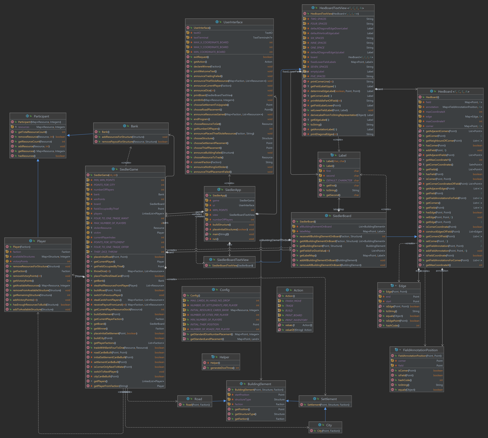
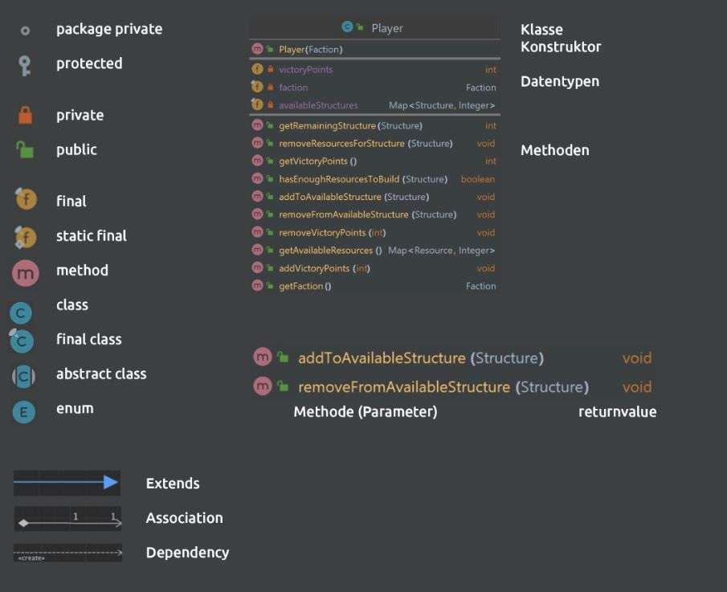

# Project 3: Siedler von Catan

## Overview

This project is a simplified version of the game "Siedler von Catan". To play the game, first clone the project to your
local directory and simply run the main method inside the SiedlerApp.java file and follow the instructions given in the
terminal.
The "siedler game" was written in Java 17 and is compatible with up to Java 19. To see all the features and commands of
this game, jump to [this section](#commands-and-features).

The project contains various JUnit tests to test the functionality and ensure that the program is working as intended.
The JUnit version used in this project is `5.8.1`. The documentation for each test can be read inside the corresponding
test class.

## Commands and features

Throughout the game the following main commands will be needed:

* `BUILD`
* `TRADE`
* `PRINT_INVENTORY`
* `PRINT_BOARD`
* `FINISH_MOVE`

Any coordinate you need to enter will be using the "Anleitung.pdf" as a guide for the points on the board.
They are entered by first typing in the x coordinate and then typing in the y coordinate.

### BUILD

The build command lets you build one of the following structures once you gathered enough resources:

* Road
* Settlement
* City 

If you decide not to build anything for now, simply select `Back`.

### TRADE

This command lets you trade four of the same resources with the bank.
First you need to choose which resource you would like to trade in and in a second step which resource you would like to receive.

Resource types:

* Grain
* Ore
* Brick
* Lumber
* Wool
  
You can trade four of the same resource for one resource of your choice.

### PRINT_INVENTORY

Shows your current inventory, including structures and resources.

### PRINT_BOARD

This command prints the board as it currently is.

### FINISH_MOVE

Once you are done trading and building, select this command to finish your move. The game will then continue with the next player.

## Class diagram

## Description Class Diagram

